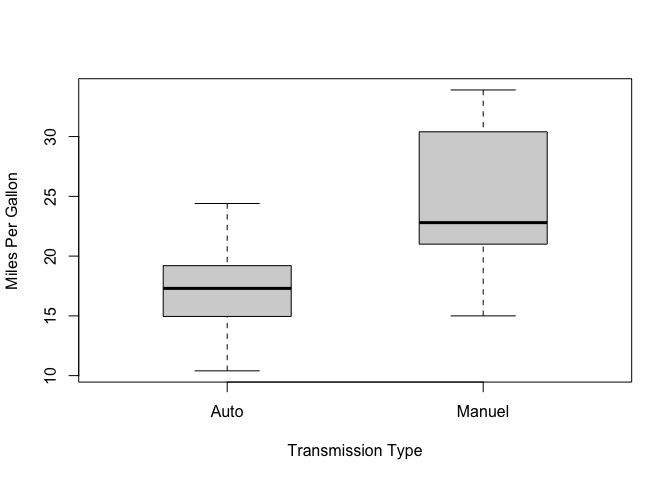
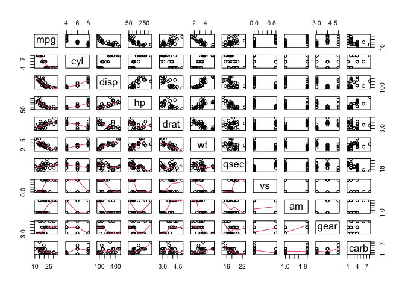
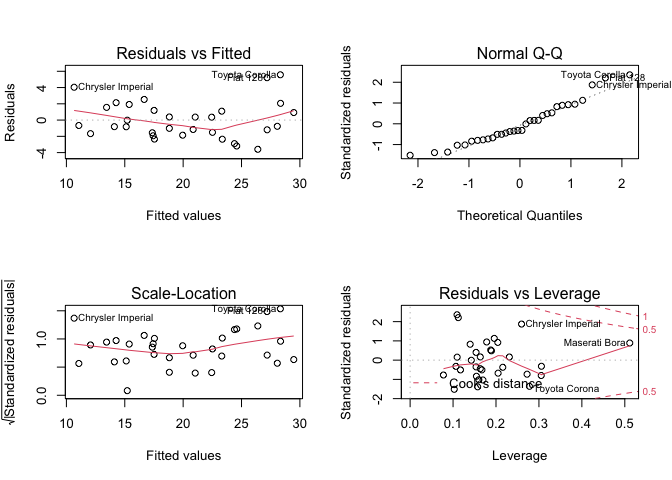

## 1. Executive Summary

The objective of this project is used to explore the relationship between a set of variables and miles per gallon (MPG) by using **mtcars** dataset and to answer:

* Is an automatic or manual transmission better for MPG
* Quantify the MPG difference between automatic and manual transmissions

As an executive summary, it could be concluded that manual transmission is 7.24 MPG better than automatic transmission in average. However, it is observed that variables  weight (**wt**), gross horsepower (**hp**), number of cylinders (**cyl**) and displacement (**disp**) also have significant relationship with MPG.

## 2. Exploratory Data Analysis

Dataset **mtcars** is loaded and explored as below:


```r
data(mtcars)
str(mtcars)
```

```
## 'data.frame':	32 obs. of  11 variables:
##  $ mpg : num  21 21 22.8 21.4 18.7 18.1 14.3 24.4 22.8 19.2 ...
##  $ cyl : num  6 6 4 6 8 6 8 4 4 6 ...
##  $ disp: num  160 160 108 258 360 ...
##  $ hp  : num  110 110 93 110 175 105 245 62 95 123 ...
##  $ drat: num  3.9 3.9 3.85 3.08 3.15 2.76 3.21 3.69 3.92 3.92 ...
##  $ wt  : num  2.62 2.88 2.32 3.21 3.44 ...
##  $ qsec: num  16.5 17 18.6 19.4 17 ...
##  $ vs  : num  0 0 1 1 0 1 0 1 1 1 ...
##  $ am  : num  1 1 1 0 0 0 0 0 0 0 ...
##  $ gear: num  4 4 4 3 3 3 3 4 4 4 ...
##  $ carb: num  4 4 1 1 2 1 4 2 2 4 ...
```

```r
head(mtcars, 3)
```

```
##                mpg cyl disp  hp drat    wt  qsec vs am gear carb
## Mazda RX4     21.0   6  160 110 3.90 2.620 16.46  0  1    4    4
## Mazda RX4 Wag 21.0   6  160 110 3.90 2.875 17.02  0  1    4    4
## Datsun 710    22.8   4  108  93 3.85 2.320 18.61  1  1    4    1
```

In order to analyze whether automatic or manual transmission is better for MPG, a boxplot is used to illustrate the correlation between **mpg** and **am** as shown in *Section 4.1* and corresponding t-test is shown below:


```r
mtcars$am <- factor(mtcars$am, labels = c("Auto", "Manuel"))
t.test(mtcars[mtcars$am=="Auto",]$mpg, mtcars[mtcars$am=="Manuel",]$mpg)
```

```
## 
## 	Welch Two Sample t-test
## 
## data:  mtcars[mtcars$am == "Auto", ]$mpg and mtcars[mtcars$am == "Manuel", ]$mpg
## t = -3.7671, df = 18.332, p-value = 0.001374
## alternative hypothesis: true difference in means is not equal to 0
## 95 percent confidence interval:
##  -11.280194  -3.209684
## sample estimates:
## mean of x mean of y 
##  17.14737  24.39231
```

It is observed that manual transmission is 7.24 MPG better than automatic transmission in average. The p-value is 0.001374, which is less than 0.05, indicating that it is a significant difference.

## 3. Regression Model

The Linear Model of **mpg** on **am** is


```r
model_1 <- lm(mpg ~ am, data = mtcars)
summary(model_1)
```

```
## 
## Call:
## lm(formula = mpg ~ am, data = mtcars)
## 
## Residuals:
##     Min      1Q  Median      3Q     Max 
## -9.3923 -3.0923 -0.2974  3.2439  9.5077 
## 
## Coefficients:
##             Estimate Std. Error t value Pr(>|t|)    
## (Intercept)   17.147      1.125  15.247 1.13e-15 ***
## amManuel       7.245      1.764   4.106 0.000285 ***
## ---
## Signif. codes:  0 '***' 0.001 '**' 0.01 '*' 0.05 '.' 0.1 ' ' 1
## 
## Residual standard error: 4.902 on 30 degrees of freedom
## Multiple R-squared:  0.3598,	Adjusted R-squared:  0.3385 
## F-statistic: 16.86 on 1 and 30 DF,  p-value: 0.000285
```

It is observed that although manual transmission is better than automatic transmission in MPG, Multiple R-squared is only 0.36 which indicates that only 36% of the variance could be explained. More variables are needed to be considered.

According to the pairs plot shown in *Section 4.2*, it is observed that **cyl**, **disp**, **hp** and **wt** may have significant relationship to **mpg**. Thus, additional models are built as shown below for assessment:


```r
model_2 <- lm(mpg ~ am + wt + hp + cyl + disp, data = mtcars)
model_3 <- lm(mpg ~ ., data = mtcars)
```

According to the ANOVA test as shown below,

```r
anova(model_1, model_2, model_3)
```

```
## Analysis of Variance Table
## 
## Model 1: mpg ~ am
## Model 2: mpg ~ am + wt + hp + cyl + disp
## Model 3: mpg ~ cyl + disp + hp + drat + wt + qsec + vs + am + gear + carb
##   Res.Df    RSS Df Sum of Sq       F    Pr(>F)    
## 1     30 720.90                                   
## 2     26 163.12  4    557.78 19.8538 6.809e-07 ***
## 3     21 147.49  5     15.63  0.4449    0.8121    
## ---
## Signif. codes:  0 '***' 0.001 '**' 0.01 '*' 0.05 '.' 0.1 ' ' 1
```
it is observed that the p-value of **model_2** (**mpg ~ am + wt + cyl + disp + hp**) is 6.809e-07, which is less than 0.05, indicating that it is significant different compared with **model_1** (**mpg ~ am**) and **model_3** (**mpg ~ .**), respectively. 

The Linear Model of **model_2** is as shown below:


```r
summary(model_2)
```

```
## 
## Call:
## lm(formula = mpg ~ am + wt + hp + cyl + disp, data = mtcars)
## 
## Residuals:
##     Min      1Q  Median      3Q     Max 
## -3.5952 -1.5864 -0.7157  1.2821  5.5725 
## 
## Coefficients:
##             Estimate Std. Error t value Pr(>|t|)    
## (Intercept) 38.20280    3.66910  10.412 9.08e-11 ***
## amManuel     1.55649    1.44054   1.080  0.28984    
## wt          -3.30262    1.13364  -2.913  0.00726 ** 
## hp          -0.02796    0.01392  -2.008  0.05510 .  
## cyl         -1.10638    0.67636  -1.636  0.11393    
## disp         0.01226    0.01171   1.047  0.30472    
## ---
## Signif. codes:  0 '***' 0.001 '**' 0.01 '*' 0.05 '.' 0.1 ' ' 1
## 
## Residual standard error: 2.505 on 26 degrees of freedom
## Multiple R-squared:  0.8551,	Adjusted R-squared:  0.8273 
## F-statistic:  30.7 on 5 and 26 DF,  p-value: 4.029e-10
```
It is observed that the Multiple R-squared is 0.85 which indicates that 85% of the variance have been covered and corresponding plots for Residuals are shown in *Section 4.3*.

## 4. Appendix

### 4.1 Boxplot of mpg and am


```r
boxplot(mpg ~ am, data = mtcars, boxwex = 0.5,  ylab = "Miles Per Gallon", xlab = "Transmission Type")
```

<!-- -->

### 4.2 Pairs Plot mtcars


```r
pairs(mpg ~ ., lower.panel = panel.smooth, data = mtcars)
```

<!-- -->

### 4.3 Residuals Plot of model_2


```r
par(mfrow = c(2, 2))
plot(model_2)
```

<!-- -->
